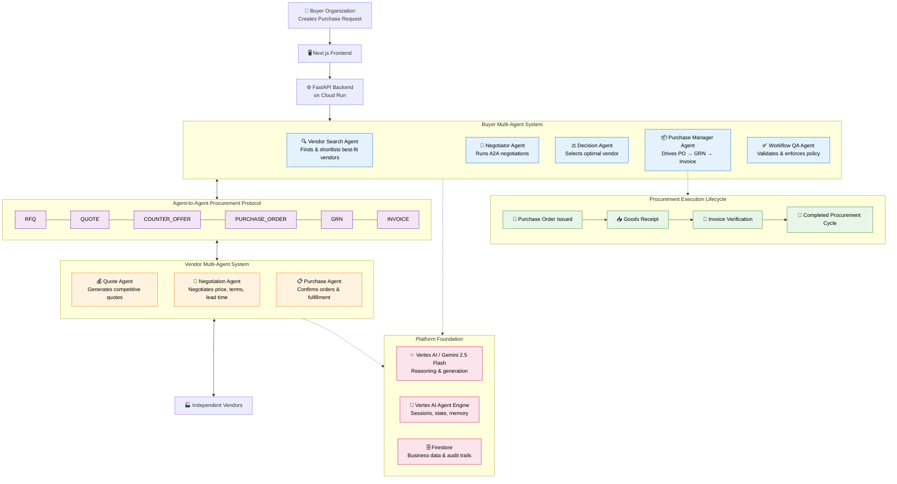

# ProcuForge — End-to-End Architecture

ProcuForge architecture

```mermaid
flowchart TB
    Buyer["👤 Buyer Organization<br/>Creates Purchase Request"]
    Frontend["🖥️ Next.js Frontend"]
    Backend["⚙️ FastAPI Backend<br/>on Cloud Run"]
    Vendors["🏭 Independent Vendors"]

    Buyer --> Frontend --> Backend

    subgraph BuyerMAS["Buyer Multi-Agent System"]
        direction TB
        VSA["🔍 Vendor Search Agent<br/>Finds & shortlists best-fit vendors"]
        NA["💬 Negotiator Agent<br/>Runs A2A negotiations"]
        DA["⚖️ Decision Agent<br/>Selects optimal vendor"]
        PMA["📦 Purchase Manager Agent<br/>Drives PO → GRN → Invoice"]
        QA["✅ Workflow QA Agent<br/>Validates & enforces policy"]
    end

    subgraph A2A["Agent-to-Agent Procurement Protocol"]
        direction LR
        M1["RFQ"] --- M2["QUOTE"] --- M3["COUNTER_OFFER"] --- M4["PURCHASE_ORDER"] --- M5["GRN"] --- M6["INVOICE"]
    end

    subgraph VendorMAS["Vendor Multi-Agent System"]
        direction TB
        QtA["💰 Quote Agent<br/>Generates competitive quotes"]
        VNA["🤝 Negotiation Agent<br/>Negotiates price, terms, lead time"]
        VPA["📋 Purchase Agent<br/>Confirms orders & fulfillment"]
    end

    Backend --> BuyerMAS
    BuyerMAS <--> A2A
    A2A <--> VendorMAS
    VendorMAS <--> Vendors

    subgraph Lifecycle["Procurement Execution Lifecycle"]
        direction LR
        L1["📄 Purchase Order Issued"] --> L2["📥 Goods Receipt"] --> L3["🧾 Invoice Verification"] --> L4["🎯 Completed Procurement Cycle"]
    end

    PMA -.-> Lifecycle

    subgraph Foundation["Platform Foundation"]
        direction LR
        F1["✨ Vertex AI / Gemini 2.5 Flash<br/>Reasoning & generation"]
        F2["🧠 Vertex AI Agent Engine<br/>Sessions, state, memory"]
        F3["🗄️ Firestore<br/>Business data & audit trails"]
    end

    BuyerMAS -.-> Foundation
    VendorMAS -.-> Foundation

    classDef buyerStyle fill:#e3f2fd,stroke:#1976d2,color:#000
    classDef vendorStyle fill:#fff3e0,stroke:#f57c00,color:#000
    classDef protocolStyle fill:#f3e5f5,stroke:#7b1fa2,color:#000
    classDef lifecycleStyle fill:#e8f5e9,stroke:#388e3c,color:#000
    classDef foundationStyle fill:#fce4ec,stroke:#c2185b,color:#000

    class VSA,NA,DA,PMA,QA buyerStyle
    class QtA,VNA,VPA vendorStyle
    class M1,M2,M3,M4,M5,M6 protocolStyle
    class L1,L2,L3,L4 lifecycleStyle
    class F1,F2,F3 foundationStyle
```