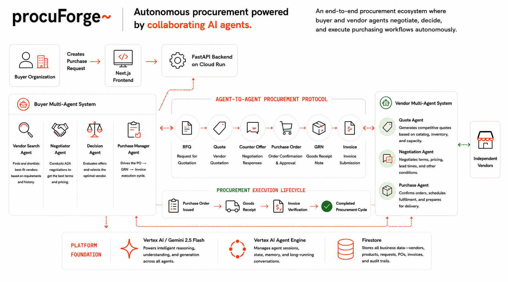
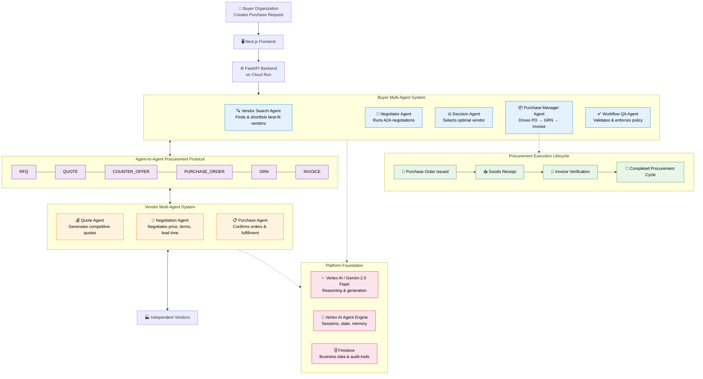

# ProcuForge — End-to-End Architecture

## Flow

A buyer creates a procurement request through the **Next.js frontend**, which hits the **FastAPI backend on Cloud Run**. The **Buyer Multi-Agent System** takes over:

- **Vendor Search Agent** — finds and shortlists best-fit vendors based on requirements and history.
- **Negotiator Agent** — conducts A2A negotiations with each shortlisted vendor to get the best terms and pricing.
- **Decision Agent** — evaluates offers and selects the optimal vendor.
- **Purchase Manager Agent** — drives the PO → GRN → Invoice execution cycle.
- **Workflow QA Agent** — validates each step and ensures policy compliance.

Buyer and vendor sides communicate over the **Agent-to-Agent Procurement Protocol** with six message types: `RFQ`, `QUOTE`, `COUNTER_OFFER`, `PURCHASE_ORDER`, `GRN`, and `INVOICE`. See [`buyer_vendor_communication_reference.md`](./buyer_vendor_communication_reference.md) for the schema.

The **Vendor Multi-Agent System** responds through the same protocol:

- **Quote Agent** — generates competitive quotes based on catalog, inventory, and capacity.
- **Negotiation Agent** — negotiates terms, pricing, lead times, and other conditions.
- **Purchase Agent** — confirms orders, schedules fulfillment, and prepares for delivery.

The **Procurement Execution Lifecycle** runs Purchase Order Issued → Goods Receipt → Invoice Verification → Completed Procurement Cycle.

## Platform foundation

| Layer | Service |
|---|---|
| Reasoning / generation | **Vertex AI / Gemini 2.5 Flash** powers reasoning and generation across all agents. |
| Agent runtime | **Vertex AI Agent Engine** manages agent sessions, state, memory, and long-running conversations. |
| Data | **Firestore** stores all business data — vendors, products, requests, POs, invoices, and audit trails. |
