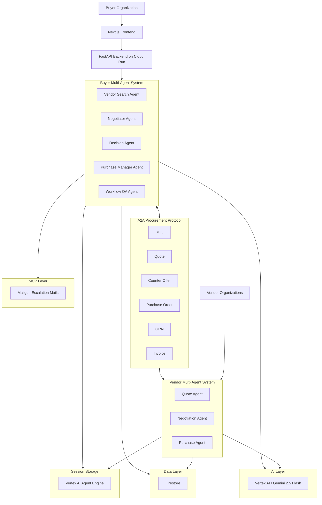

# ProcuForge — End-to-End Architecture

## Flow

A buyer creates a procurement request through the Next.js frontend, which hits the FastAPI backend on Cloud Run. The Buyer Multi-Agent System takes over: **Vendor Search** shortlists suppliers, **Negotiator** runs A2A conversations with each, **Decision** picks the winner, and **Purchase Manager** drives the PO → GRN → invoice cycle. The Vendor Multi-Agent System replies through the same A2A protocol with its **Quote**, **Negotiation**, and **Purchase** agents. Both systems share Firestore for business data, Vertex AI Agent Engine for session state, and Vertex AI Gemini 2.5 Flash for inference. When negotiations stall or thresholds are breached, the buyer system pushes an escalation through the MCP layer to deliver emails via Mailgun.
